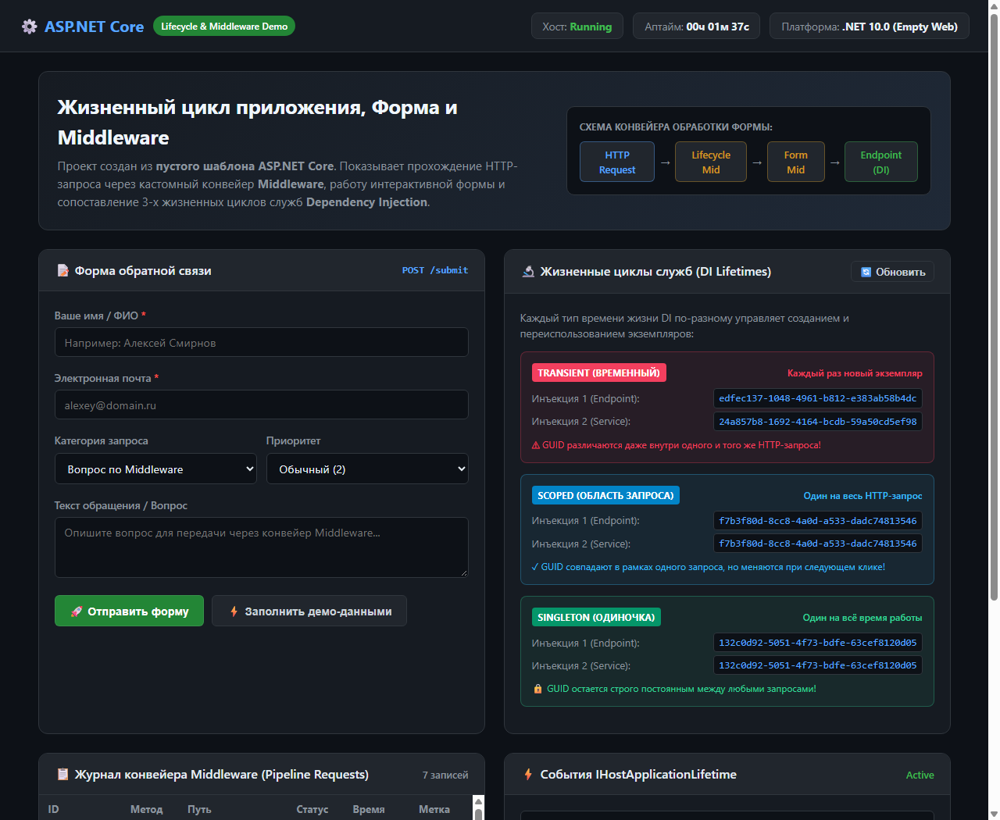
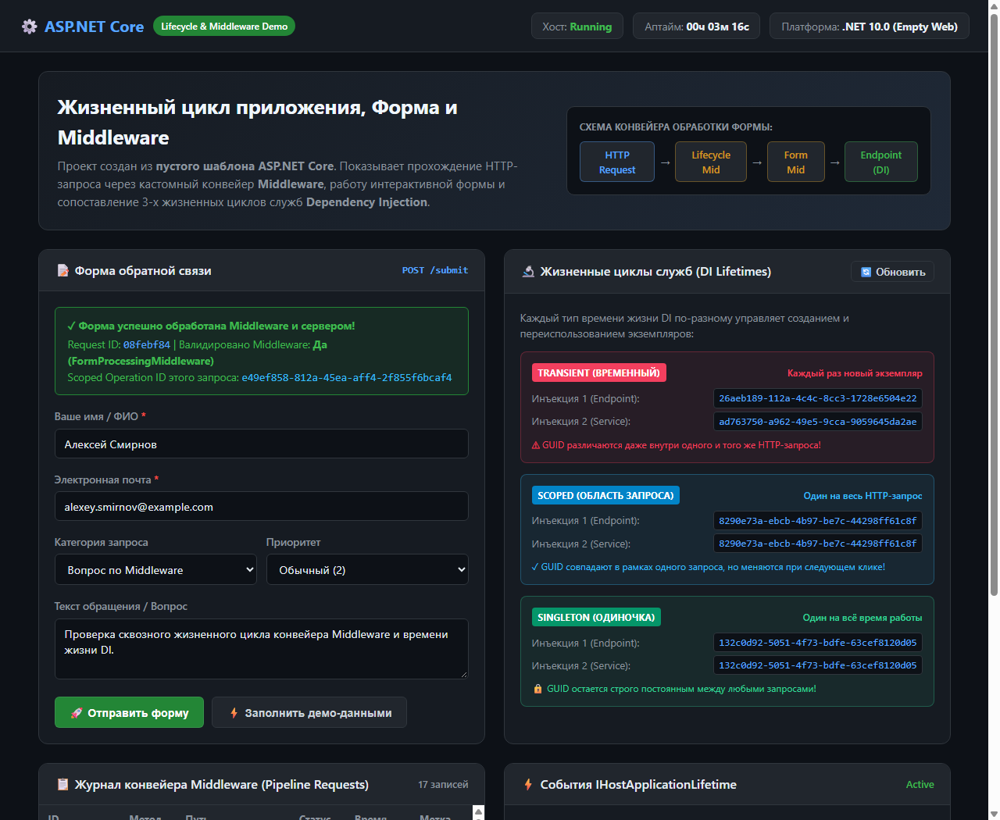
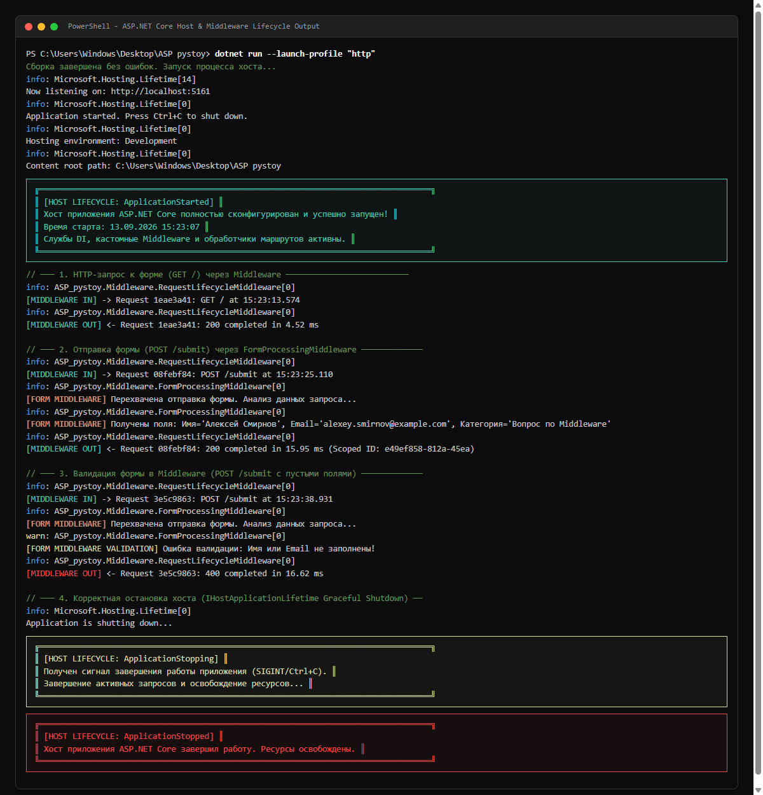

# Веб-приложение ASP.NET Core: Жизненный цикл приложения, Форма и Middleware

Данный проект создан с нуля на базе **пустого шаблона ASP.NET Core** (`dotnet new web`) в рамках домашнего задания по дисциплине *"Разработка веб-приложений на ASP.NET и AJAX"*.

Проект наглядно демонстрирует:
1. **Создание формы** ввода и отправки данных (поддерживает как стандартную отправку, так и AJAX-запрос).
2. **Привязку кастомных Middleware** к конвейеру обработки запросов (сквозное логирование, замер времени, перехват и валидация данных формы).
3. **Полный жизненный цикл приложения**:
   - **Жизненный цикл хоста** (`IHostApplicationLifetime`): события запуска, штатной остановки и завершения.
   - **Жизненные циклы сервисов в Dependency Injection**: детальное сопоставление `Transient`, `Scoped` и `Singleton`.
   - **Жизненный цикл HTTP-запроса (Request Pipeline)**: прохождение через цепочку Middleware туда и обратно.

---

## 📸 Скриншоты работы приложения

### 1. Веб-интерфейс: Форма обратной связи и дашборд жизненного цикла
> Отображение состояния хоста (Uptime, статус), формы, схемы конвейера и текущих идентификаторов DI-сервисов при `GET /`.


---

### 2. Отправка формы через конвейер Middleware
> Результат обработки формы кастомным Middleware (`POST /submit`): валидация полей, генерация `Request ID`, вывод подтверждения и обновление `Scoped` идентификаторов при новом запросе.


---

### 3. Консоль: Полный жизненный цикл хоста и конвейера запросов
> Логирование старта хоста (`ApplicationStarted`), перехват запросов Middleware (IN/OUT), валидация формы и завершение работы хоста (`ApplicationStopping`, `ApplicationStopped`).


---

## 🔄 Архитектура и жизненные циклы

### 1. Жизненный цикл хоста (Host Lifetime — `IHostApplicationLifetime`)

В ASP.NET Core приложение управляется хостом, который предоставляет события жизненного цикла:

```csharp
var lifetime = app.Services.GetRequiredService<IHostApplicationLifetime>();

// 1. Приложение полностью инициализировано и готово принимать запросы
lifetime.ApplicationStarted.Register(() => {
    Console.WriteLine("[HOST LIFECYCLE: ApplicationStarted]");
});

// 2. Получен сигнал остановки (SIGINT/Ctrl+C) — запущен Graceful Shutdown
lifetime.ApplicationStopping.Register(() => {
    Console.WriteLine("[HOST LIFECYCLE: ApplicationStopping]");
});

// 3. Все фоновые службы остановлены, ресурсы освобождены
lifetime.ApplicationStopped.Register(() => {
    Console.WriteLine("[HOST LIFECYCLE: ApplicationStopped]");
});
```

---

### 2. Конвейер Middleware (HTTP Request Pipeline)

Запрос проходит через цепочку компонентов по модели «матрёшки»:

```
[Входящий HTTP-запрос]
       │
       ▼
┌────────────────────────────────────────┐
│  RequestLifecycleMiddleware (IN)       │ ──► Фиксирует Request ID, путь, метод, старт таймера
└────────────────────────────────────────┘
       │
       ▼
┌────────────────────────────────────────┐
│  FormProcessingMiddleware (IN)         │ ──► Перехватывает POST /submit, валидирует имя и email
└────────────────────────────────────────┘
       │
       ▼
┌────────────────────────────────────────┐
│  Маршрутизатор / Конечная точка        │ ──► Получает сервисы из DI, формирует ответ
└────────────────────────────────────────┘
       │
       ▼
┌────────────────────────────────────────┐
│  FormProcessingMiddleware (OUT)        │ ──► Постобработка формы
└────────────────────────────────────────┘
       │
       ▼
┌────────────────────────────────────────┐
│  RequestLifecycleMiddleware (OUT)      │ ──► Замеряет итоговое время (мс), статус ответа
└────────────────────────────────────────┘
       │
       ▼
[Исходящий HTTP-ответ клиенту]
```

#### Реализация кастомных Middleware:

1. **`RequestLifecycleMiddleware`** — замеряет время выполнения (`Stopwatch`), добавляет заголовки ответа (`X-Request-Id`, `X-Elapsed-Ms`) и сохраняет историю запросов.
2. **`FormProcessingMiddleware`** — перехватывает запросы к форме, считывает данные из `context.Request.ReadFormAsync()`, валидирует обязательные поля и передает результат в `context.Items`.

---

### 3. Жизненные циклы сервисов DI (Dependency Injection)

В проекте зарегистрированы 3 типа времени жизни объектов:

| Тип времени жизни | Регистрация | Поведение в приложении |
| :--- | :--- | :--- |
| **`Transient`** | `AddTransient<IOperationTransient, Operation>()` | Экземпляр создается **заново при каждом внедрении**. Даже в рамках одного HTTP-запроса `Transient 1` и `Transient 2` имеют **разные GUID**. |
| **`Scoped`** | `AddScoped<IOperationScoped, Operation>()` | Экземпляр создается **один раз на весь HTTP-запрос**. Внутри одного запроса `Scoped 1` и `Scoped 2` имеют **одинаковый GUID**, но при следующем запросе генерируется **новый GUID**. |
| **`Singleton`** | `AddSingleton<IOperationSingleton, Operation>()` | Экземпляр создается **один раз при старте хоста** и сохраняется **неизменным** на протяжении всей работы веб-сервера. |

---

## 📁 Структура проекта

```text
ASP pystoy/
├── Middleware/
│   ├── RequestLifecycleMiddleware.cs   # Сквозной Middleware логирования и времени
│   └── FormProcessingMiddleware.cs      # Middleware перехвата и валидации формы
├── Models/
│   └── FeedbackFormModel.cs            # Модели формы обратной связи и логов
├── Services/
│   ├── IOperation.cs                   # Интерфейсы и сервисы Transient/Scoped/Singleton
│   └── IAppLifetimeMonitor.cs          # Монитор состояния хоста и истории запросов
├── Properties/
│   └── launchSettings.json             # Настройки запуска (порты http/https)
├── screenshots/
│   ├── 01_form_and_dashboard.png       # Скриншот формы и начального состояния DI
│   ├── 02_form_submitted.png           # Скриншот отправленной формы и обновления Scoped ID
│   └── 03_console_lifecycle.png        # Скриншот консоли с логами всех этапов
├── wwwroot/
│   ├── index.html                      # Веб-страница формы и интерактивного дашборда
│   ├── submitted.html                  # Состояние формы после отправки
│   └── terminal.html                   # Оформление консольного вывода
├── Program.cs                          # Точка входа, DI, жизненные циклы, маршруты
├── ASP pystoy.csproj                   # Файл проекта .NET 10.0 (Empty Web)
└── README.md                           # Документация проекта
```

---

## 🚀 Запуск и проверка

```bash
# 1. Восстановление и сборка
dotnet build

# 2. Запуск приложения
dotnet run --launch-profile "http"

# 3. Открытие в браузере:
# http://localhost:5161
```
